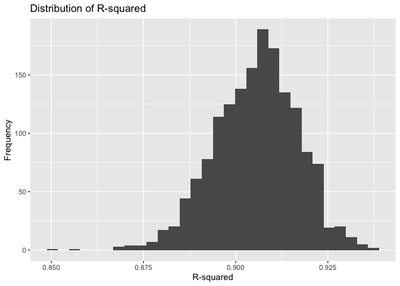
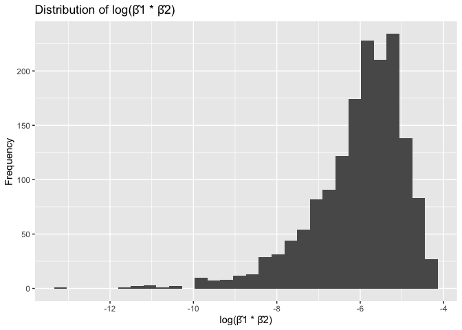
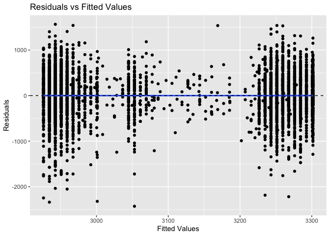

Homework 6
================
Dylan Koproski
2023-12-02

``` r
library(tidyverse)
```

    ## ── Attaching core tidyverse packages ──────────────────────── tidyverse 2.0.0 ──
    ## ✔ dplyr     1.1.3     ✔ readr     2.1.4
    ## ✔ forcats   1.0.0     ✔ stringr   1.5.0
    ## ✔ ggplot2   3.4.3     ✔ tibble    3.2.1
    ## ✔ lubridate 1.9.2     ✔ tidyr     1.3.0
    ## ✔ purrr     1.0.2     
    ## ── Conflicts ────────────────────────────────────────── tidyverse_conflicts() ──
    ## ✖ dplyr::filter() masks stats::filter()
    ## ✖ dplyr::lag()    masks stats::lag()
    ## ℹ Use the conflicted package (<http://conflicted.r-lib.org/>) to force all conflicts to become errors

``` r
library(boot)
library(modelr)
library(broom)
```

    ## 
    ## Attaching package: 'broom'
    ## 
    ## The following object is masked from 'package:modelr':
    ## 
    ##     bootstrap

## Problem 1

The below code performs the pre-processing steps outlined in the
problem. This includes omitting the specified cities using `filter`,
creating the `city_state` variable and also `mutating` the `disposition`
variable to have levels.

``` r
homicide_df = 
  read_csv('https://raw.githubusercontent.com/washingtonpost/data-homicides/master/homicide-data.csv', na = c("", "NA", "Unknown")) |> 
  mutate(
    city_state = str_c(city, state, sep = ", "),
    victim_age = as.numeric(victim_age),
    resolution = case_when(
      disposition == "Closed without arrest" ~ 0,
      disposition == "Open/No arrest"        ~ 0,
      disposition == "Closed by arrest"      ~ 1)
  ) |> 
  filter(victim_race %in% c("White", "Black")) |> 
  filter(!(city_state %in% c("Tulsa, AL", "Dallas, TX", "Phoenix, AZ", "Kansas City, MO"))) |> 
  select(city_state, resolution, victim_age, victim_sex, victim_race)
```

    ## Rows: 52179 Columns: 12
    ## ── Column specification ────────────────────────────────────────────────────────
    ## Delimiter: ","
    ## chr (8): uid, victim_last, victim_first, victim_race, victim_sex, city, stat...
    ## dbl (4): reported_date, victim_age, lat, lon
    ## 
    ## ℹ Use `spec()` to retrieve the full column specification for this data.
    ## ℹ Specify the column types or set `show_col_types = FALSE` to quiet this message.

This chunk fits a logistic regression model only with data from
`Baltimore, MD`. `resolution` is the outcome while `victim_age`,
`victim_sex`, and `victim_race` are predictors. We use `broom::tidy()`,
`mutate()` and `knitr::kable()` to present the adjusted odds ratio and
confidence intervals specified.

``` r
baltimore_glm = 
  filter(homicide_df, city_state == "Baltimore, MD") |> 
  glm(resolution ~ victim_age + victim_sex + victim_race, family = binomial(), data = _)

baltimore_glm |> 
  broom::tidy() |> 
  mutate(
    OR = exp(estimate), 
    OR_CI_upper = exp(estimate + 1.96 * std.error),
    OR_CI_lower = exp(estimate - 1.96 * std.error)) |> 
  filter(term == "victim_sexMale") |> 
  select(OR, OR_CI_lower, OR_CI_upper) |>
  knitr::kable(digits = 3)
```

|    OR | OR_CI_lower | OR_CI_upper |
|------:|------------:|------------:|
| 0.426 |       0.325 |       0.558 |

\\ The below code functions similarly to the one above, except `nest()`,
`map()`, and `unnest()` are used to fit data for each individual city.
Then, the results are printed again as above.

``` r
model_results = 
  homicide_df |> 
  nest(data = -city_state) |> 
  mutate(
    models = map(data, \(df) glm(resolution ~ victim_age + victim_sex + victim_race, family = binomial(), data = df)),
    tidy_models = map(models, broom::tidy)) |> 
  select(-models, -data) |> 
  unnest(cols = tidy_models) |> 
  mutate(
    OR = exp(estimate), 
    OR_CI_upper = exp(estimate + 1.96 * std.error),
    OR_CI_lower = exp(estimate - 1.96 * std.error)) |> 
  filter(term == "victim_sexMale") |> 
  select(city_state, OR, OR_CI_lower, OR_CI_upper)

model_results |>
  slice(1:5) |> 
  knitr::kable(digits = 3)
```

| city_state      |    OR | OR_CI_lower | OR_CI_upper |
|:----------------|------:|------------:|------------:|
| Albuquerque, NM | 1.767 |       0.831 |       3.761 |
| Atlanta, GA     | 1.000 |       0.684 |       1.463 |
| Baltimore, MD   | 0.426 |       0.325 |       0.558 |
| Baton Rouge, LA | 0.381 |       0.209 |       0.695 |
| Birmingham, AL  | 0.870 |       0.574 |       1.318 |

## Problem 2

The below code is taken from the homework description. It loads the data
and and creates required variables using `mutate()`.

``` r
weather_df = 
  rnoaa::meteo_pull_monitors(
    c("USW00094728"),
    var = c("prcp", "tmin", "tmax"), 
    date_min = "2022-01-01",
    date_max = "2022-12-31") |>
  mutate(
    name = recode(id, USW00094728 = "CentralPark_NY"),
    tmin = tmin / 10,
    tmax = tmax / 10) |>
  select(name, id, everything())
```

    ## using cached file: /Users/dkoproski/Library/Caches/org.R-project.R/R/rnoaa/noaa_ghcnd/USW00094728.dly

    ## date created (size, mb): 2023-09-28 10:18:49.741945 (8.524)

    ## file min/max dates: 1869-01-01 / 2023-09-30

The below code first specifies the `model_formula` that will be used for
each of the bootstrap samples. I then make a function for each
`bootstrap_sample` which applies the model formula to each sample, pulls
the coefficients out of each model, uses the coefficients to calculate
beta, then finally takes the log of beta for the final part of the
problem. Note that I had to apply
`ifelse(beta_prod > 0, log(beta_prod), NA` since the function would not
run otherwise as it would attempt to take the log of negative numbers.

``` r
model_formula = tmax ~ tmin + prcp

compute_metrics = function(bootstrap_sample) {
  model = lm(model_formula, data = bootstrap_sample) 
  rsq = summary(model)$r.squared
  coefs = coef(model)
  beta_prod = coefs["tmin"] * coefs["prcp"]
  log_beta_prod = ifelse(beta_prod > 0, log(beta_prod), NA)
  list(r_squared = rsq, log_beta_prod = log_beta_prod)
}
```

This code takes the 5000 bootstrap samples using `modelr::boostrap` then
plots the distributions. The histogram of R-squared shows a normal
distribution centered around roughly 0.91. The histogram of
`log(\beta_1 * \beta_1)` appears to be left skewed but still maintains a
roughly normal shape around -6.

``` r
set.seed(2023)
bootstrap_samples = weather_df |> 
  modelr::bootstrap(5000)

bootstrap_results = 
  bootstrap_samples$strap |> 
  map_dfr(~compute_metrics(.x))

bootstrap_results = 
  na.omit(bootstrap_results)

p1 = 
  ggplot(bootstrap_results, aes(x = r_squared)) +
  geom_histogram(bins = 30) +
  labs(title = "Distribution of R-squared", x = "R-squared", y = "Frequency")

p2 = 
  ggplot(bootstrap_results, aes(x = log_beta_prod)) +
  geom_histogram(bins = 30) +
  labs(title = "Distribution of log(β̂1 * β̂2)", x = "log(β̂1 * β̂2)", y = "Frequency")


p1
```

<!-- -->

``` r
p2
```

<!-- -->

The histogram of R-squared shows a normal distribution centered around
roughly 0.91. The histogram of `log(\beta_1 * \beta_1)` appears to be
left skewed but still maintains a roughly normal shape around -6. \\ The
confidence intervals for `r_squared` and `log_beta` are as follows:

``` r
bootstrap_results |> 
  summarize(
    lower_CI = quantile(r_squared, 0.025, na.rm = TRUE),
    upper_CI = quantile(r_squared, 0.975, na.rm = TRUE)) |> 
  knitr::kable()
```

|  lower_CI |  upper_CI |
|----------:|----------:|
| 0.8825407 | 0.9262962 |

``` r
bootstrap_results |> 
  summarize(
    lower_CI = quantile(log_beta_prod, 0.025, na.rm = TRUE),
    upper_CI = quantile(log_beta_prod, 0.975, na.rm = TRUE)) |> 
  knitr::kable()
```

|  lower_CI |  upper_CI |
|----------:|----------:|
| -8.864579 | -4.538391 |

## Problem 3

First I tidy the dataset and convert add levels to all categorial
variables so that they may be used for regression.

``` r
birthweight_df = read_csv("data/birthweight.csv") |>
  mutate(
    babysex = factor(babysex, levels = c(1, 2), labels = c("Male", "Female")),
    frace = factor(frace, levels = c(1, 2, 3, 4, 8, 9)),
    mrace = factor(mrace, levels = c(1, 2, 3, 4, 8)),
    malform = factor(malform, levels = c(0, 1))
  ) |>
  drop_na() 
```

    ## Rows: 4342 Columns: 20
    ## ── Column specification ────────────────────────────────────────────────────────
    ## Delimiter: ","
    ## dbl (20): babysex, bhead, blength, bwt, delwt, fincome, frace, gaweeks, malf...
    ## 
    ## ℹ Use `spec()` to retrieve the full column specification for this data.
    ## ℹ Specify the column types or set `show_col_types = FALSE` to quiet this message.

For this first model, I wanted to determine how
demographic/socioeconomic factors factors affect `bwt` As such, I chose
`fincome`, `frace` and `mrace` as my predictors when making the model.
As mentioned above, I gave these variables levels so that they would
work with a regression model.

``` r
model_1 = lm(bwt ~ fincome + frace + mrace, data = birthweight_df)

birthweight_df |> 
  add_predictions(model_1) |>
  add_residuals(model_1) |> 
  ggplot(aes(x = pred, y = resid)) +
  geom_point() +
  geom_smooth(method = "lm") +
  geom_hline(yintercept = 0, linetype = "dashed") +
  labs(title = "Residuals vs Fitted Values", x = "Fitted Values", y = "Residuals")
```

    ## `geom_smooth()` using formula = 'y ~ x'

<!-- -->

From the residual plot, I do not think this is a good model. I instead
suspect that there is non-constant variance in the residuals as well as
evidence that the model is non-linear. \\

Lastly, the code below fits models 2 and 3 according to the problem. It
then uses cross validation to test the models. I use the `crossv_mc`
function to perform the cross validation, then `mutate` 3 new columns
for each of the 3 regressions. I then use mutate again to get the `rmse`
for each observation before using `summarise` to get the mean rmse for
each option.

``` r
model_2 = lm(bwt ~ blength + gaweeks, data = birthweight_df)
model_3 = lm(bwt ~ bhead + blength + babysex+ bhead * blength * babysex, data = birthweight_df)


cv_df = 
  crossv_mc(birthweight_df, 100)|>
  mutate(
    model_1 = map(train, ~lm(bwt ~ fincome + frace + mrace, data = birthweight_df)),
    model_2 = map(train, ~lm(bwt ~ blength + gaweeks, data = .)),
    model_3 = map(train, ~lm(bwt ~ bhead + blength + babysex+ bhead * blength * babysex, data = birthweight_df))
  ) |>
  mutate(
    rmse_1 = map2_dbl(model_1, test, ~rmse(model = .x, data = .y)),
    rmse_2 = map2_dbl(model_2, test, ~rmse(model = .x, data = .y)),
    rmse_3 = map2_dbl(model_3, test, ~rmse(model = .x, data = .y))
  )

summary_cv = cv_df |>
  summarise(
    rmse_1 = mean(rmse_1),
    rmse_2 = mean(rmse_2),
    rmse_3 = mean(rmse_3)
  )

summary_cv |> 
  knitr::kable()
```

|   rmse_1 |  rmse_2 |   rmse_3 |
|---------:|--------:|---------:|
| 487.1587 | 332.631 | 286.4983 |

Of these models, it appears that model 3 is the best option. This is
because it has the lowest rmse of the models. That being said, this is
not a thorough investigation of the models and more analysis should be
performed before deciding on any a final model.
